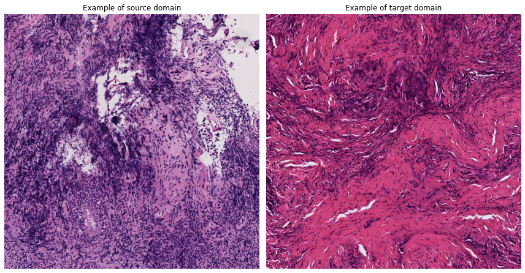
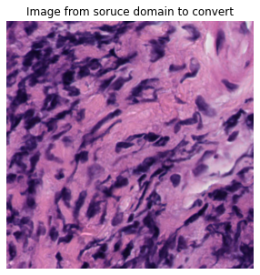
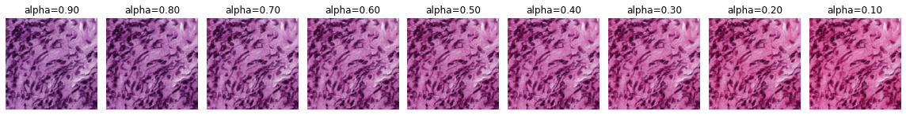

# Stain Mix-up

This repository provide the core idea of [Stain Mix-Up: Domanin Generalization for Histopathology Images](https://link.springer.com/chapter/10.1007/978-3-030-87199-4_11) as an image augmentation technique.  
To address the issue of unseen color domain generalization in histopathological images, the `stain mix-up` interpolates stain matrices between soruce and target domain to generate augmented images during training time for model generalization.

## Publication
Chang, J.-R., Wu, M.-S., Yu, W.-H., Chen, C.-C., Yang, C.-K., Lin, Y.-Y., & Yeh, C.-Y. (2021). Stain mix-up: Unsupervised domain generalization for histopathology images. Medical Image Computing and Computer Assisted Intervention – MICCAI 2021, 117–126. https://doi.org/10.1007/978-3-030-87199-4_11

## License
Copyright (C) 2021 aetherAI Co., Ltd. All rights reserved. Licensed under the CC BY-NC-SA 4.0 license (https://creativecommons.org/licenses/by-nc-sa/4.0/legalcode).

## Examples




## Installation
To install the package, users can simply clone the repository and pip install it.
```bash
$ git clone https://github.com/aetherAI/stain-mixup.git
$ cd stain_mixup
$ pip install .
```

## Usage
1. Get stain matrix.
You can derive your stain matrix by different methods such as Vahadane or Macenko.
```python
from stain_mixup.utils import get_stain_matrix


stain_matrix = get_stain_matrix(image)
```
***Note: Larger/more images will generate a more stable stain matrix. We strongly recommend users to generate a stable stain matrix by refering to official [spams](http://thoth.inrialpes.fr/people/mairal/spams/)***

2. Convert image from the source domain to target domain.
```python
from stain_mixup.augment import stain_mixup

...

augmented_image = stain_mixup(
    image,
    source_stain_matrix,
    target_stain_matrix,
)
```

## Contributors
Jia-Ren Chang, Min-Shen Wu, Wei-Hsiang Yu, Chi-Chung Chen, Che-Ming Wu
